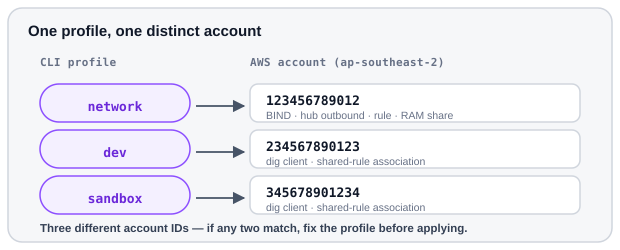

# Check profiles

Confirm each CLI profile resolves to a **different** account before editing
tfvars.



<p class="diagram-caption">Phase 0 goal: three profiles, three distinct accounts. Account IDs shown are placeholders.</p>

Print just the account ID for each profile:

<div class="run" markdown>

```bash
for p in network dev sandbox; do
  echo "$p -> $(aws sts get-caller-identity --profile "$p" --query Account --output text)"
done
```

```text {.no-copy}
network -> 123456789012
dev     -> 234567890123
sandbox -> 345678901234
```

</div>

All three IDs must be **different**. Keep them — network needs them for
`workload_account_ids`.

## If a check fails

Log the profile back in, then re-run the loop above:

<div class="run" markdown>

```bash
aws sso login --profile network
```

```text {.no-copy}
Attempting to open your default browser.
...
Successfully logged into Start URL: https://d-xxxxxxxxxx.awsapps.com/start
```

</div>

<div class="run" markdown>

```bash
aws sso login --profile dev
```

```text {.no-copy}
Successfully logged into Start URL: https://d-xxxxxxxxxx.awsapps.com/start
```

</div>

<div class="run" markdown>

```bash
aws sso login --profile sandbox
```

```text {.no-copy}
Successfully logged into Start URL: https://d-xxxxxxxxxx.awsapps.com/start
```

</div>

Next: [Build the hub](hub.md).
