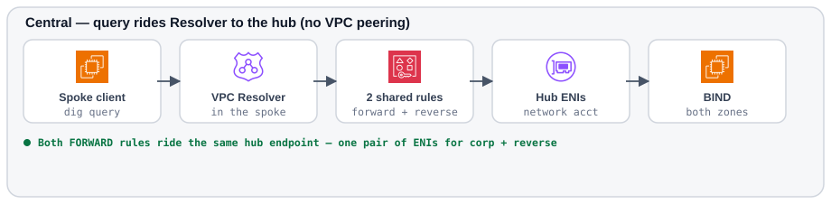
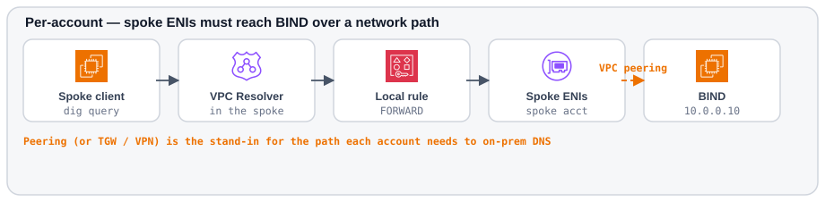
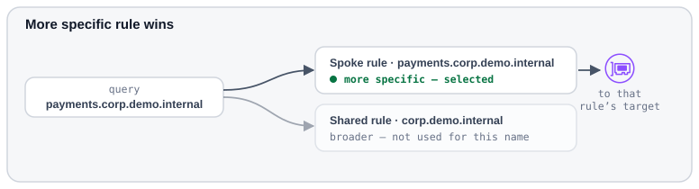

# Design

Outbound DNS forwarding sends VPC queries for a chosen domain to one or more target IPs (here, a BIND server in the network account that stands in for corporate DNS).

## Request path

### Central

Resolver in the spoke VPC selects a shared rule and forwards through the hub endpoint. Both the forward and reverse rules use the same pair of hub ENIs. No VPC peering is required for resolution — the query never leaves Resolver's own path to the hub.

1. The spoke VPC associates a FORWARD rule shared from the network account via **AWS RAM**.
2. Route 53 Resolver in the spoke matches `corp.demo.internal` and sends the query to the **network** outbound endpoint.
3. The hub endpoint (ENIs in the network VPC) queries BIND on UDP/TCP 53.
4. BIND answers authoritatively. Recursion is off.

The network VPC also associates the same rule so its own test client uses the identical path.

### Per-account

Each account owns an outbound endpoint. The last hop (orange) needs a network path: peering stands in for the TGW or VPN each account would use to reach on-premises DNS. The public demo walkthrough is central-only; enable this path via <code>outbound_pattern = "per-account"</code> in Terraform (see <a href="../demo/">Demo</a> / <code>terraform/README.md</code>).

1. Each account creates its own outbound endpoint and FORWARD rule targeting the BIND IP.
2. Spoke outbound ENIs must reach `10.0.0.10` in the network VPC — via **VPC peering** when you run the per-account Terraform path.
3. Network accepts peering, adds return routes, and opens BIND security group ingress from spoke CIDRs.

## RAM sharing

| Environment | Behaviour |
| --- | --- |
| AWS Organization with RAM org sharing enabled | Shares auto-accept. Do **not** create an accepter resource (it fails). |
| Standalone accounts / no org auto-accept | Set `ram_share_accept_required = true` and pass `ram_share_arn` so the spoke stack accepts the invitation. |

Only the **rule** is shared. The outbound endpoint stays in the network account. Query charges for traffic through that endpoint land on the **endpoint owner** (network) — a chargeback consideration.

## One endpoint, many domains

The endpoint is the data plane (ENIs). Each FORWARD rule is a domain → target-IP mapping that
selects an endpoint. AWS configures outbound forwarding as [an outbound endpoint and one or more
rules](https://docs.aws.amazon.com/Route53/latest/DeveloperGuide/resolver-forwarding-outbound-queries-configuring.html).

| What you add | What you create |
| --- | --- |
| Second corporate zone (same path to DNS) | Another rule on the **same** hub endpoint |
| Reverse lookups (`in-addr.arpa`) | Another rule on the **same** hub endpoint |
| Second VPC that needs those zones | Associate the existing rule(s) (central) |

A second domain does **not** require a second endpoint. Split endpoints only when you need
isolation, a different path to DNS, or capacity — not because the zone name changed.

This demo attaches **two** rules to one hub endpoint — `corp.demo.internal` (A) and
`100.0.10.in-addr.arpa` (PTR) — and shares both via RAM. Same ENI bill either way.

## Regional scope

Resolver endpoints and rules are **regional**. A hub in `ap-southeast-2` does not serve `ap-southeast-1`. Production multi-region designs need one outbound endpoint (and usually a regional DNS target or anycast) per region.

## Rule precedence

A more specific domain name in a spoke-owned rule wins over a broader shared rule. Example: a spoke rule for `payments.corp.demo.internal` overrides a shared rule for `corp.demo.internal` for that name. AWS routes a query that matches more than one rule using [the most specific domain name](https://docs.aws.amazon.com/Route53/latest/DeveloperGuide/resolver-overview-forward-vpc-to-network-domain-name-matches.html).

That is the usual **escape hatch**: keep central for the broad zone, and give a critical
account its own outbound + a tighter FORWARD rule so those names do not share the hub’s
failure domain. Patterns covers when to use it: [Escape hatch](patterns.md#escape-hatch-central-a-little-per-account).

## Demo BIND caveats

- Single EC2 instance, fixed private IP `10.0.0.10` so target IPs survive replacement.
- Production would use at least two DNS targets on the FORWARD rule.
- Zone `corp.demo.internal` uses the reserved `.internal` TLD (avoids `.local` mDNS confusion).
- Reverse zone `100.0.10.in-addr.arpa` covers the synthetic A-record /24 (`10.0.100.10` /
  `10.0.100.20`). PTR queries need their own FORWARD rule — the forward-zone rule does not
  match `in-addr.arpa`.
