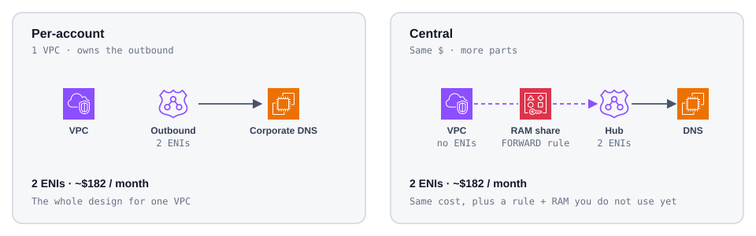
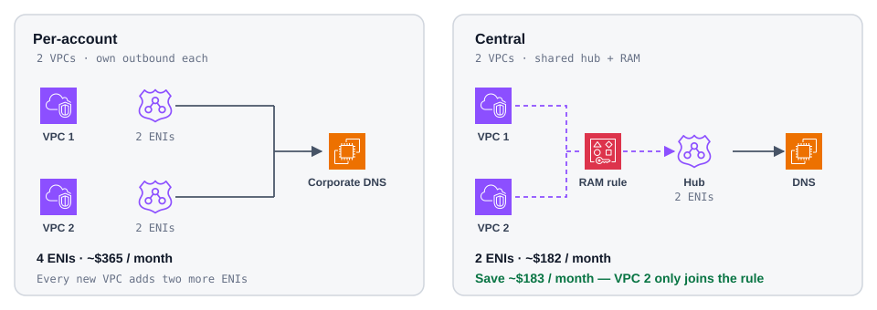
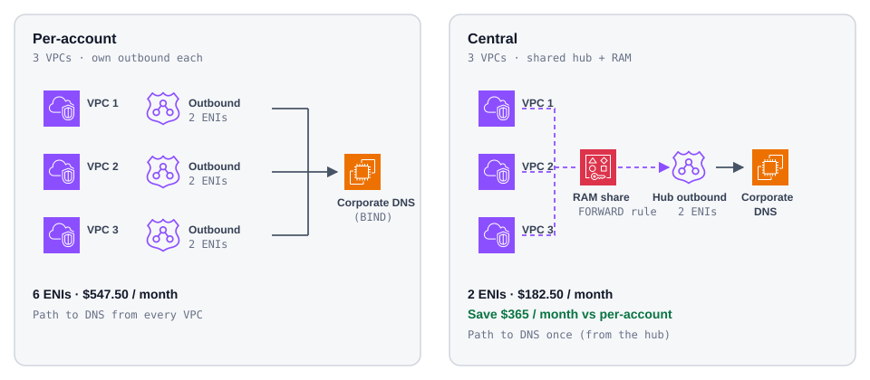
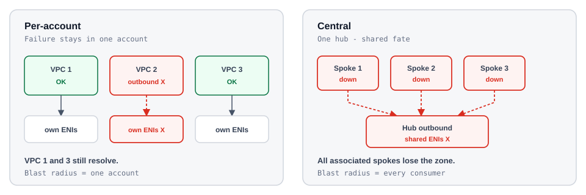
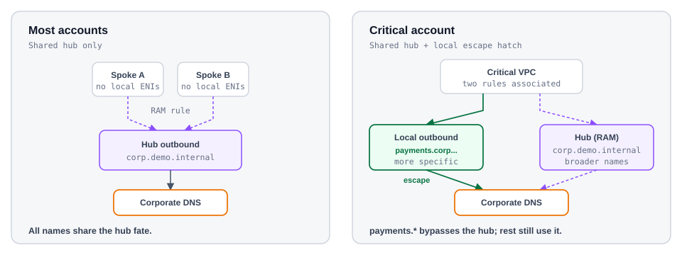
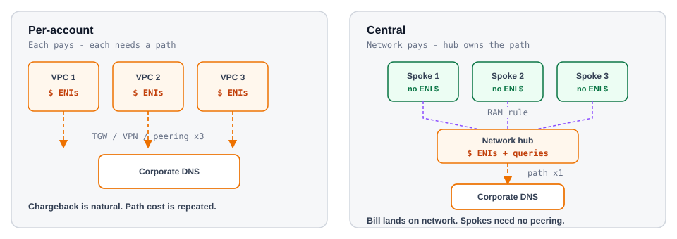

# Patterns

Same job: resolve a corporate zone (`corp.demo.internal`) from your VPCs.

Two shapes — **per-account** (each VPC owns an outbound endpoint) or **central** (one hub in the network account; FORWARD rule shared with RAM).

The question is not which diagram is prettier. It is **when central earns the complexity**.

## 1 · One VPC — no win yet

Stand up an outbound endpoint (two ENIs), point a rule at corporate DNS, done. That **is** per-account — and for a single VPC it is the whole design.

Central can do the same work, but you still pay for two ENIs **and** you add a shareable rule plus RAM for one consumer. Same **$182.50**/month. Ceremony you do not use.

One VPC, same $182.50/month either way — central just adds a rule and RAM you do not use yet.

**Prefer per-account.** Central is not cheaper yet — it is a standalone resolver with extras bolted on.

## 2 · Two VPCs — benefit starts

The second VPC that needs the same zone is the break-even.

Per-account adds another endpoint → **four ENIs**, **$365**/month.  
Central still has **two ENIs**, **$182.50**/month — the new VPC only associates the shared rule.

The second VPC is break-even: per-account doubles to four ENIs while central stays at two — about $182.50/month saved.

That is when the RAM you introduced starts to pay for itself.

## 3 · Many VPCs — the gap widens

Each extra VPC (same region, same zones) adds **$182.50**/month on per-account and ~$0 on central.
Extra domains are extra FORWARD rules on the **same** endpoint — they do not multiply ENIs
(see Design → [One endpoint, many domains](design.md#one-endpoint-many-domains)).

Same diagram as Overview — three VPCs is where the Overview table lands.

| VPCs | Per-account | Central | You save | Where you are |
| ---: | ---: | ---: | ---: | --- |
| 1 | $182.50 | $182.50 | $0 | no win yet |
| 2 | $365.00 | $182.50 | **$182.50** | benefit starts |
| 3 | $547.50 | $182.50 | **$365.00** | diagram above |
| 10 | $1,825.00 | $182.50 | **$1,642.50** | gap keeps widening |

Full assumptions and query bands: [Cost](cost.md).

## 4 · Cost is not the only tradeoff

Central halves ENIs from the second VPC on — and concentrates the data plane.

### Blast radius

Every associated spoke forwards through the **same** hub endpoint and shared rules.
A bad rule change, endpoint outage, or network-account misconfig can break resolution for
all of them at once. Per-account keeps that failure domain inside one account: one VPC’s
outbound problem does not take down another’s.

Same zone, different failure domains — per-account contains the outage; central shares it.

Hardening the hub (extra ENIs across AZs, multiple DNS target IPs) reduces AZ and
on-prem DNS risk — it does **not** remove shared config fate. Profiles package DNS
config; they are not a second live outbound data plane for the same shared rule.

### Escape hatch (central + a little per-account)

Most VPCs stay on the shared hub rule. A few critical accounts keep their **own**
outbound endpoint and a **more specific** FORWARD rule for the names they cannot
afford to lose with everyone else.

Resolver picks the [most specific domain name](https://docs.aws.amazon.com/Route53/latest/DeveloperGuide/resolver-overview-forward-vpc-to-network-domain-name-matches.html)
when several rules match. So a spoke rule for `payments.corp.demo.internal` wins over
the shared `corp.demo.internal` rule for that name — traffic for that slice uses the
spoke’s ENIs and path to DNS, not the hub. Everything else on that VPC can still use
the shared rule.

Green path = more-specific local rule (escape hatch). Purple = shared hub rule for everything else on that VPC.

| Piece | Typical choice |
| --- | --- |
| Most accounts / broad zone | Shared hub rule via RAM |
| Critical subdomain or account | Local outbound + more-specific rule |
| Path to DNS for the escape hatch | That account still needs TGW / VPN / peering |

You pay ~$182/month per escape-hatch endpoint (two ENIs). Use it sparingly — a few
critical slices, not every VPC — or you recreate per-account cost. Design already
shows the precedence beat: [Rule precedence](design.md#rule-precedence).

### Who pays and who owns the plane

Query and ENI charges land on the **endpoint owner** — under central, the network account.
Spokes look “free” for that traffic; if you need per-account chargeback, you invent it
yourself (or stay per-account).

Spokes only associate the shared rule. They cannot resize, replace, or debug the hub ENIs
without the network team. That is the ops cost of the savings.

### Path to DNS

Per-account’s downside cuts the other way: each VPC still needs a network path to the DNS
IP (TGW, VPN, or peering). Central pays that path once at the hub; spokes need no peering
for resolution.

Orange dashed lines are the network path to the DNS IP — repeated per VPC on the left, once at the hub on the right.

| Factor | Per-account | Central |
| --- | --- | --- |
| Blast radius | One account | All associated spokes |
| Chargeback | Each account pays its ENIs / queries | Network pays hub ENIs / queries |
| Ops ownership | Each account | Network account |
| Path to DNS IP | Every VPC | Hub once |

## Takeaway

| Situation | Choose |
| --- | --- |
| One VPC | **Per-account** |
| Two or more VPCs, same region and zones, cost matters, shared blast radius is OK | **Central** |
| Mostly central, a few critical names/accounts need their own failure domain | **Central + escape hatch** (local outbound + more-specific rule) |
| Isolation, independent failure domains, or per-account chargeback first | **Per-account** |
| Multi-region | Hub (or endpoints) **per region** — central does not cross regions |

How the query moves once you pick: [Design](design.md).  
Numbers behind the table: [Cost](cost.md).  
Run the lab: [Demo](demo/index.md).  
Sources: [References](references.md).
